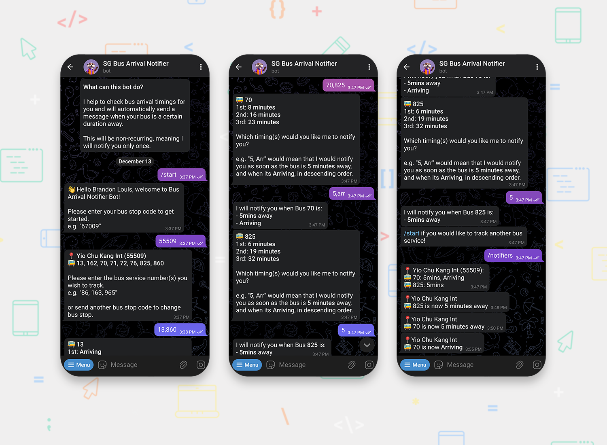

<h1 align="center">Bus Arrival Notifier Bot (Python, MongoDB)</h1>

[Telegram Bot](https://t.me/SGBusArrivalNotifierBot)

A Telegram chatbot which notifies users when their buses are certain duration away

## Screenshots

## Built with

- Python
- MongoDB Atlas
- [pyTelegramBotAPI](https://pytba.readthedocs.io/en/latest/index.html)

## Useful resources

- [ArriveLah](https://github.com/cheeaun/arrivelah) - Bus Service Information

## Author

- GitHub - https://github.com/brandonlouis
- LinkedIn - [Brandon Louis Chia](www.linkedin.com/in/brandon-louis-chia-63730b162)
